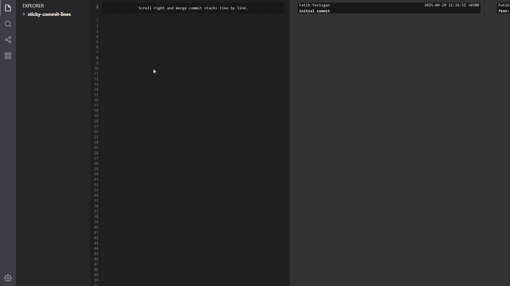

# Sticky Commit Lines

Understand how commits keep changes in files in a git repository. 

Scroll right and merge commit stacks line by line.



## Getting Started

1. Clone this project.
2. Navigate to the project directory.

### Installation

To install dependencies and build the project, run:
```sh
npm install
```

### Running
To start the project and see result, run:
```sh
npm run dev
```

### Deploying
To export the project and upload your website, run:
```sh
npm run build
```
#### Deploying Github Pages
To deploy github pages the project and see result, run:
```sh
npm run deploy
```

## Changing Inner Git Repository

You should firstly get git datas as JSON from your repository.
#### Execute gitToJson on your repository folder
https://github.com/yarliganfatih/sticky-commit-lines/blob/main/tools/gitToJson.js
To get JSON git data of your project and copy result, run:
```sh
node gitToJson
```
Save JSON data as `src/assets/data.json` and build this project.

### Used Repository Example
https://github.com/yarliganfatih/sticky-commit-lines-demo
This repository was the first version of this project.

After executing gitToJson, result is like this => https://github.com/yarliganfatih/sticky-commit-lines/blob/main/src/assets/data.json